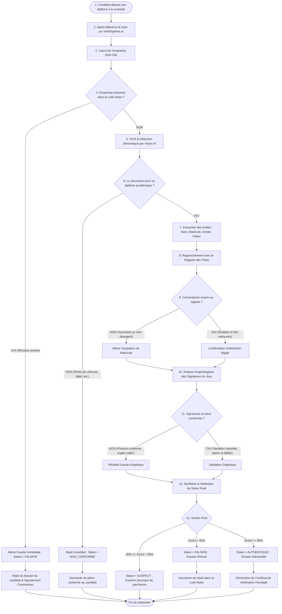
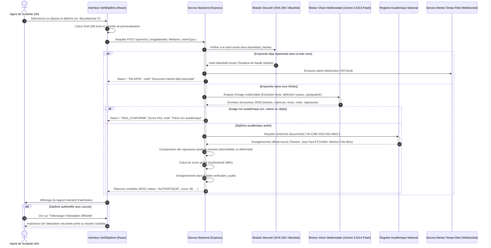
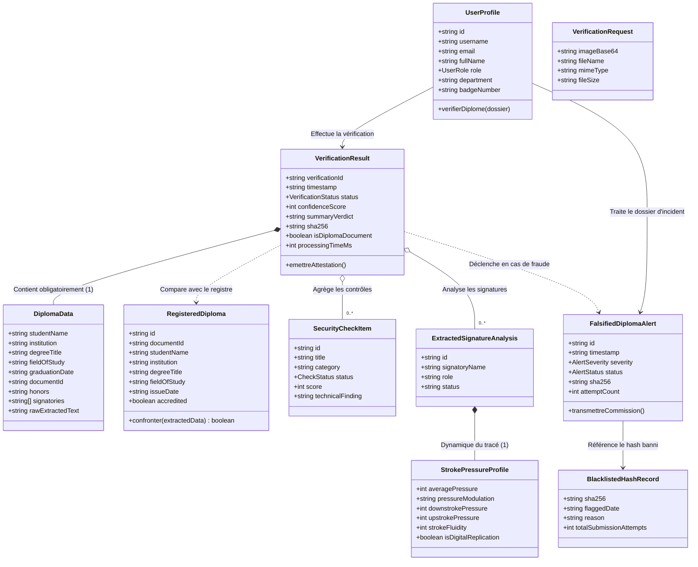

# Analyse & Spécifications de Conception du Système
## VerifDiplôme.ai — Contrôle d'Authenticité des Diplômes Académiques pour les Dossiers d'Admission (Cas Campus IAI-Cameroun)

---

## 1. Présentation & Délimitation du Projet

### 1.1 Périmètre Strict : Diplômes Académiques Uniquement
> ⚠️ **Délimitation formelle** : Le système est exclusivement dédié à la vérification des **titres et diplômes académiques** (Baccalauréat de l'enseignement secondaire, GCE A-Level, BTS, DUT, Licence, Master, Diplôme d'Ingénieur, Doctorat). **Aucun certificat médical, attestation médicale ou document sanitaire n'entre dans le périmètre du projet.**

### 1.2 Problématique Métier Concrète
Chaque année, lors des campagnes de recrutement et de concours d'entrée (par exemple au **campus de l'IAI-Cameroun - Institut Africain d'Informatique** pour le cycle Ingénieur des Travaux Informatiques ou Master), des centaines de candidats déposent leurs dossiers physiques ou numériques.

Chaque dossier contient obligatoirement un **diplôme antérieur justificatif** :
- Pour un candidat postulant en 1ère année : son **Baccalauréat** (Série C, D, TI - Technologies de l'Information) ou son **GCE Advanced Level**.
- Pour un candidat postulant en admission sur titre ou Master : son **BTS**, **DUT** ou sa **Licence** en Informatique.

**Le Défi** : Les agents de la scolarité et les commissions d'admission font face à des tentatives régulières de fraude (contrefaçon de relevés, faux diplômes générés par logiciel, modification du nom de l'impétrant, fausses signatures de recteurs ou de présidents de jury).

**La Solution** : À chaque dépôt de dossier, l'agent de scolarité soumet le scan du diplôme à **VerifDiplôme.ai**. La plateforme répond instantanément par un verdict d'authenticité étayé :
1. **AUTHENTIQUE** : Diplôme certifié, conforme au registre d'autorité et exempt d'altération $\rightarrow$ **Dossier de candidature recevable**.
2. **FALSIFIÉ** : Altération détectée (nom modifié, fausse signature, numéro inexistant ou usurpé) $\rightarrow$ **Dossier rejeté, alerte émise, empreinte inscrite sur liste noire**.
3. **SUSPECT** : Discordance mineure ou trace de manipulation $\rightarrow$ **Dossier mis en attente pour vérification physique du parchemin original**.
4. **NON CONFORME** : Le document soumis n'est pas un diplôme académique (ex: photo personnelle, véhicule, facture) $\rightarrow$ **Rejet immédiat pour pièce invalide**.

---

## 2. Les Acteurs et Leurs Rôles

| Acteur | Nature | Rôle et Responsabilités dans le Processus d'Admission |
| :--- | :--- | :--- |
| **Candidat / Postulant** | Utilisateur externe | Dépose son dossier de candidature comportant son diplôme académique requis pour le concours ou l'inscription. |
| **Agent de Scolarité / Admissions (ex: IAI-Cameroun)** | Opérateur principal | • Réceptionne le dossier du candidat.<br>• Numérise ou téléverse le diplôme sur l'application.<br>• Vérifie le score d'authenticité et les concordances d'identité.<br>• Valide ou invalide la recevabilité du dossier du candidat.<br>• Imprime le certificat d'attestation de conformité académique. |
| **Responsable des Études & Commission Anti-Fraude** | Décisionnaire | • Traite les dossiers étiquetés `SUSPECT` ou `FALSIFIE`.<br>• Convoque le candidat pour audition disciplinaire en cas d'usurpation avérée.<br>• Valide l'inscription sur liste noire des empreintes falsifiées récidivistes. |
| **Administrateur du Système Académique** | Gestionnaire | • Enregistre et met à jour les séries officielles de diplômes au registre.<br>• Administre les comptes des agents de scolarité (habilitations et rôles).<br>• Supervise les statistiques d'admissions et l'historique d'audit. |
| **Moteur IA & Vision Multimodale (Gemini 3.6/3.8 Flash)** | Système automatisé | • Effectue l'OCR haute fidélité (détection du nom de l'étudiant, matricule, filière, date, mentions).<br>• Identifie les modifications graphiques (police divergente, superposition de calques, effacements).<br>• Procède à l'analyse graphologique des signatures manuscrites (pression, fluidité, angle de tracé).<br>• Écarte immédiatement tout document non académique. |
| **Registre Central des Titres Académiques** | Base d'autorité | Base fédérée répertoriant les diplômes authentiques délivrés (Office du Baccalauréat, Universités d'État, Grandes Écoles accréditées). |

---

## 3. Schéma de Base de Données : Toutes les Tables

Le modèle relationnel s'articule autour de 6 tables de données :

```
+------------------+         +-------------------------+
|      users       |         |   registered_diplomas   |
+------------------+         +-------------------------+
| id (PK)          |         | id (PK)                 |
| username         |         | document_id (UNIQUE)    |
| password_hash    |         | student_name            |
| salt             |         | institution             |
| role             |         | degree_title            |
| department       |         | field_of_study          |
| badge_number     |         | issue_date              |
+--------+---------+         | accredited              |
         |                   +------------+------------+
         | opère                          | vérifié avec
         v                                v
+------------------+         +------------+------------+
|  verif_audits    |-------->|   signature_forensics   |
+------------------+         +-------------------------+
| verification_id  |         | id (PK)                 |
| timestamp        |         | verification_id (FK)    |
| sha256           |         | signatory_name          |
| student_name     |         | signatory_role          |
| status           |         | morphological_score     |
| confidence_score |         | stroke_fluidity         |
| is_diploma       |         | pressure_modulation     |
+--------+---------+         | verdict                 |
         |                   +-------------------------+
         | déclenche si fraude
         v
+------------------+         +-------------------------+
| falsif_alerts    |<------->|   blacklisted_hashes    |
+------------------+         +-------------------------+
| id (PK)          |         | sha256 (PK)             |
| sha256 (FK)      |         | flagged_date            |
| severity         |         | reason                  |
| status           |         | detection_source        |
| attempt_count    |         | total_attempts          |
+------------------+         +-------------------------+
```

### Table 1 : `users` (Agents de Scolarité & Administrateurs)
Stocke les identifiants et rôles des personnels habilités à vérifier les dossiers d'admission.
| Champ | Type | Contraintes | Description |
| :--- | :--- | :--- | :--- |
| `id` | `VARCHAR(36)` | `PRIMARY KEY` | Identifiant UUID de l'agent. |
| `username` | `VARCHAR(50)` | `UNIQUE, NOT NULL` | Login d'accès (ex: `scolarite_iai`, `admin`). |
| `email` | `VARCHAR(120)` | `UNIQUE, NOT NULL` | Courriel académique. |
| `password_hash` | `VARCHAR(128)` | `NOT NULL` | Empreinte sécurisée du mot de passe (SHA-256 avec sel). |
| `salt` | `VARCHAR(32)` | `NOT NULL` | Sel cryptographique aléatoire de hachage. |
| `full_name` | `VARCHAR(100)` | `NOT NULL` | Nom et prénom de l'agent (ex: "Claire Fontaine"). |
| `role` | `VARCHAR(20)` | `NOT NULL` | Rôle : `VERIFICATEUR` (Scolarité), `ANALYSTE` (Commission Fraude), `ADMIN`. |
| `department` | `VARCHAR(150)` | `NOT NULL` | Service (ex: "Direction de la Scolarité - IAI-Cameroun"). |
| `badge_number` | `VARCHAR(30)` | `NOT NULL` | Matricule professionnel de l'agent. |
| `created_at` | `TIMESTAMP` | `DEFAULT NOW()` | Date de création du compte. |
| `last_login` | `TIMESTAMP` | `NULLABLE` | Date de dernière connexion. |

---

### Table 2 : `registered_diplomas` (Registre Officiel des Diplômes Académiques)
Référentiel des diplômes légitimes délivrés par les organismes certificateurs (Office du Bac, Universités, IAI).
| Champ | Type | Contraintes | Description |
| :--- | :--- | :--- | :--- |
| `id` | `VARCHAR(36)` | `PRIMARY KEY` | Identifiant interne du titre (ex: `REG-007`). |
| `document_id` | `VARCHAR(50)` | `UNIQUE, NOT NULL` | Numéro d'enregistrement officiel du diplôme (ex: `IAI-CMR-2023-ING-0842` ou `OBC-2022-BAC-TI-4190`). |
| `student_name` | `VARCHAR(150)` | `NOT NULL` | Nom exact de l'impétrant (ex: "Jean Paul ETOUNDI"). |
| `institution` | `VARCHAR(200)` | `NOT NULL` | Établissement de délivrance (ex: "IAI-Cameroun", "Office du Baccalauréat"). |
| `degree_title` | `VARCHAR(250)` | `NOT NULL` | Grade académique (ex: "Diplôme d'Ingénieur des Travaux Informatiques", "Baccalauréat Série TI"). |
| `field_of_study`| `VARCHAR(150)` | `NOT NULL` | Spécialité (ex: "Génie Logiciel", "Technologies de l'Information"). |
| `issue_date` | `DATE` | `NOT NULL` | Date de soutenance ou de proclamation des résultats. |
| `honors` | `VARCHAR(50)` | `NULLABLE` | Mention accordée (Très Bien, Bien, Assez Bien). |
| `accredited` | `BOOLEAN` | `DEFAULT TRUE` | Titre reconnu par le Ministère de tutelle (MINESUP / MINESEC). |

---

### Table 3 : `verification_audits` (Historique d'Audit des Dossiers Vérifiés)
Consignation immuable de chaque contrôle effectué sur un dossier de candidature.
| Champ | Type | Contraintes | Description |
| :--- | :--- | :--- | :--- |
| `verification_id`| `VARCHAR(36)` | `PRIMARY KEY` | Code de traçabilité d'audit (ex: `VDF-2026-A94E21`). |
| `timestamp` | `TIMESTAMP` | `NOT NULL` | Date et heure précise du contrôle du dossier. |
| `sha256` | `VARCHAR(64)` | `NOT NULL` | Condensat cryptographique du fichier examiné. |
| `file_name` | `VARCHAR(255)` | `NOT NULL` | Nom du fichier soumis (ex: `baccalaureat_etoundi.pdf`). |
| `file_size` | `VARCHAR(30)` | `NOT NULL` | Poids du fichier numérisé. |
| `student_name` | `VARCHAR(150)` | `NOT NULL` | Nom du candidat extrait du diplôme. |
| `institution` | `VARCHAR(200)` | `NOT NULL` | Établissement émetteur indiqué sur la pièce. |
| `degree_title` | `VARCHAR(250)` | `NOT NULL` | Titre présenté dans le dossier. |
| `status` | `VARCHAR(20)` | `NOT NULL` | Résultat : `AUTHENTIQUE`, `SUSPECT`, `FALSIFIE`, `NON_CONFORME`. |
| `confidence_score`| `INT` | `0-100` | Degré de certitude calculé par le système. |
| `is_diploma` | `BOOLEAN` | `NOT NULL` | `TRUE` si c'est un diplôme, `FALSE` si hors-sujet. |
| `summary_verdict`| `TEXT` | `NOT NULL` | Synthèse du rapport destinée à la commission d'admission. |
| `processing_time`| `INT` | `NOT NULL` | Durée de l'analyse en millisecondes. |

---

### Table 4 : `blacklisted_hashes` (Liste Noire des Faux Diplômes Répertoriés)
Empreintes des documents falsifiés déjà interceptés pour neutraliser toute tentative de réutilisation dans d'autres concours.
| Champ | Type | Contraintes | Description |
| :--- | :--- | :--- | :--- |
| `sha256` | `VARCHAR(64)` | `PRIMARY KEY` | Empreinte unique du faux document. |
| `flagged_date` | `TIMESTAMP` | `NOT NULL` | Date de la première tentative frauduleuse. |
| `reason` | `TEXT` | `NOT NULL` | Détail de la fraude (ex: "Altération du nom sur un diplôme IAI officiel"). |
| `original_student`| `VARCHAR(150)` | `NULLABLE` | Identité figurant sur la contrefaçon. |
| `detection_source`| `VARCHAR(50)` | `NOT NULL` | `COMMISSION_ADMISSION`, `SIGNALEMENT_OFFICIEUX`, etc. |
| `total_attempts` | `INT` | `DEFAULT 1` | Nombre de fois que ce faux a été présenté. |
| `last_attempt` | `TIMESTAMP` | `NOT NULL` | Date de la dernière soumission dans un dossier. |
| `threat_level` | `VARCHAR(20)` | `NOT NULL` | Niveau de risque : `MAXIMAL`, `ELEVE`, `MODERE`. |

---

### Table 5 : `falsification_alerts` (Incidents de Fraude & Récidive)
Gestion des dossiers d'incident transmis à la direction des examens.
| Champ | Type | Contraintes | Description |
| :--- | :--- | :--- | :--- |
| `id` | `VARCHAR(36)` | `PRIMARY KEY` | Référence d'incident (ex: `ALT-2026-X109`). |
| `timestamp` | `TIMESTAMP` | `NOT NULL` | Date d'apparition de l'alerte. |
| `severity` | `VARCHAR(20)` | `NOT NULL` | `CRITIQUE` (récidive avérée), `HAUTE`, `MOYENNE`. |
| `status` | `VARCHAR(30)` | `NOT NULL` | `ACTIVE`, `EN_INVESTIGATION`, `TRANSMIS_DISCIPLINE`, `ACQUITTEE`. |
| `sha256` | `VARCHAR(64)` | `FOREIGN KEY` | Lien vers l'empreinte falsifiée. |
| `trigger_reason` | `TEXT` | `NOT NULL` | Circonstances ayant provoqué le signalement. |
| `attempt_count` | `INT` | `NOT NULL` | Nombre de tentatives constatées. |
| `handled_by` | `VARCHAR(100)` | `NULLABLE` | Agent de scolarité ou enquêteur en charge. |

---

### Table 6 : `signature_forensics` (Contrôle Graphologique des Signatures du Diplôme)
Détail de la validation biométrique des signatures officielles (Directeur, Recteur, Président du jury).
| Champ | Type | Contraintes | Description |
| :--- | :--- | :--- | :--- |
| `id` | `VARCHAR(36)` | `PRIMARY KEY` | Identifiant du contrôle de signature. |
| `verification_id`| `VARCHAR(36)` | `FOREIGN KEY` | Rapprochement avec le dossier vérifié. |
| `signatory_name` | `VARCHAR(150)` | `NOT NULL` | Nom de l'autorité signataire officielle. |
| `signatory_role` | `VARCHAR(100)` | `NOT NULL` | Fonction (ex: "Représentant Résident IAI-Cameroun"). |
| `morphological_score`| `DECIMAL(5,2)` | `0-100` | Fidélité de la trajectoire par rapport au modèle d'autorité. |
| `stroke_fluidity`| `INT` | `0-100` | Continuité du trait (recherche d'hésitation ou de tracé machine). |
| `pressure_modulation`| `VARCHAR(30)` | `NOT NULL` | `NATURELLE_DYNAMIQUE` (authentique) ou `UNIFORME_ARTIFICIELLE` (copier-coller). |
| `verdict` | `VARCHAR(50)` | `NOT NULL` | `CONFORME`, `SUSPECT_PRESSION_UNIFORME`, `CONTREFACON`. |

---

## 4. Scénarios pour le Diagramme de Cas d'Utilisation

```mermaid
graph TD
    classDef actorStyle fill:#0f172a,stroke:#334155,stroke-width:2px,color:#fff;
    classDef useCaseStyle fill:#f8fafc,stroke:#475569,stroke-width:1.5px,color:#0f172a;

    Candidat["👨‍🎓 Candidat (Dépôt Dossier)"]:::actorStyle
    AgentScol["👩‍💼 Agent de Scolarité / Admissions"]:::actorStyle
    Commission["⚖️ Commission des Concours & Discipline"]:::actorStyle
    Admin["🏛️ Administrateur Académique"]:::actorStyle
    MoteurIA["🤖 Moteur d'Extraction & Vision IA"]:::actorStyle
    Registre["📚 Registre Central des Examens"]:::actorStyle

    subgraph "Système VerifDiplôme.ai — Admissions IAI-Cameroun"
        UC1(["UC01 : Contrôler le diplôme du dossier de candidature"]):::useCaseStyle
        UC2(["UC02 : Télécharger l'Attestation Officielle de Conformité"]):::useCaseStyle
        UC3(["UC03 : Consulter & Rechercher dans le Registre Officiel"]):::useCaseStyle
        UC4(["UC04 : Enregistrer une nouvelle série de diplômes officiels"]):::useCaseStyle
        UC5(["UC05 : Traiter un dossier de fraude & instruire la sanction"]):::useCaseStyle
        UC6(["UC06 : Gérer la liste noire des faux diplômes"]):::useCaseStyle
        UC7(["UC07 : Rejet automatique des pièces non académiques"]):::useCaseStyle
        UC8(["UC08 : Authentification des personnels de scolarité"]):::useCaseStyle
    end

    Candidat -->|Fournit la copie du diplôme| AgentScol
    AgentScol --> UC1
    AgentScol --> UC2
    AgentScol --> UC3
    AgentScol --> UC8

    Commission --> UC3
    Commission --> UC5
    Commission --> UC6
    Commission --> UC8

    Admin --> UC3
    Admin --> UC4
    Admin --> UC6
    Admin --> UC8

    UC1 ..> UC7 : <<extend>> (Pièce hors sujet)
    UC1 --- MoteurIA
    UC1 --- Registre
```

### Description Détaillée des Scénarios de Cas d'Utilisation :

#### Scénario Principal : UC01 — Contrôle du Diplôme du Dossier d'Admission
- **Contexte** : Dépôt de dossier au service des admissions de l'IAI-Cameroun.
- **Acteur principal** : Agent de Scolarité.
- **Déclencheur** : Réception de la pochette physique ou électronique du candidat.
- **Préconditions** : L'agent de scolarité est connecté à son espace opérateur. Le document numérisé est lisible.
- **Flux Nominal (Diplôme Authentique)** :
  1. L'agent glisse-dépose le scan du diplôme dans la zone de dépôt.
  2. Le système génère instantanément l'empreinte cryptographique SHA-256 de la pièce.
  3. Le système consulte la table `blacklisted_hashes` : l'empreinte est inconnue.
  4. L'IA extrait le texte : Nom de l'étudiant, matricule, année d'obtention, établissement d'origine, série/filière.
  5. Le système interroge le Registre Central des Diplômes (`registered_diplomas`) avec le matricule et le nom.
  6. Le système trouve la correspondance exacte (100% concordant).
  7. Le système analyse les signatures manuscrites des autorités : la modulation de pression du tracé est naturelle et dynamique, les angles correspondent aux modèles de référence.
  8. Le système renvoie le statut `AUTHENTIQUE` avec un score de confiance de 98%+.
  9. L'agent valide la recevabilité académique du dossier du candidat et imprime l'attestation de conformité.
- **Flux Alternatif 1 (Fraude Détectée — Faux Diplôme)** :
  - À l'étape 5, le matricule du diplôme existe dans le registre mais au nom d'une autre personne (usurpation d'identité), ou le numéro est totalement inexistant.
  - L'analyse graphique relève une typographie modifiée (ex: nom inséré par retouche informatique avec une police non concordante).
  - Le système classe le dossier en `FALSIFIE` avec un score de 20%.
  - Une alerte est transmise au tableau de bord de la Commission des Concours.
  - Le dossier de candidature est automatiquement rejeté pour motif de contrefaçon.
- **Flux Alternatif 2 (Pièce Non Académique / Non Conforme)** :
  - Le candidat a chargé par erreur un fichier non académique (ex: photo personnelle, véhicule, capture d'écran de facture).
  - Dès l'étape d'analyse sémantique, aucun terme universitaire n'est détecté.
  - Le système applique le statut `NON_CONFORME` (0%).
  - L'agent notifie au candidat qu'une pièce non recevable a été fournie et exige la fourniture du véritable parchemin.

---

## 5. Scénario pour le Diagramme d'Activité

Le diagramme ci-dessous illustre le déroulement de la validation d'un dossier candidat :



---

## 6. Scénario pour le Diagramme de Séquence

Ce scénario détaille les interactions dynamiques entre les composants logiciels lors du dépôt d'un dossier :



---

## 7. Diagramme de Classes UML et Relations



---

## 8. Technologies Utilisées

| Domaine | Technologie & Outil | Justification & Rôle dans le Projet |
| :--- | :--- | :--- |
| **Interface Utilisateur (Frontend)** | **React 18** (`react`, `react-dom`) | Interface moderne à composants réactifs pour les agents de scolarité (glisser-déposer de scans, affichage en temps réel). |
| **Langage Principal** | **TypeScript 5** | Typage statique robuste des modèles de diplômes, éliminant les erreurs de manipulation des données d'étudiants. |
| **Outil de Développement & Build** | **Vite** | Démarrage instantané, temps de compilation minimal et bundling de production haute performance. |
| **Feuilles de Style & Ergonomie** | **Tailwind CSS 4** | Conception d'un design institutionnel sobre, clair, contrasté, sans clichés ni surcharges graphiques. |
| **Iconographie Métier** | **Lucide React** | Pictogrammes standardisés (certificats, empreintes, cadenas, vérifications, alertes). |
| **Serveur d'Application (Backend)** | **Node.js + Express.js** | Traitement des flux de téléversement, hébergement de l'API REST et communication avec le registre des diplômes. |
| **Exécution & Compilation Serveur** | **tsx / esbuild** | Exécution TypeScript en développement et génération d'un bundle serveur autonome et rapide pour la production. |
| **Intelligence Artificielle & Vision** | **Google Gen AI SDK (`@google/genai`)** | Modèles multimodaux de référence :<br>• **`gemini-3.6-flash`** (moteur principal recommandé par Google)<br>• **`gemini-3.8-flash`** & **`gemini-flash-latest`** (secours haute résilience en cas de pic d'admissions). |
| **OCR Sémantique & Rejet d'Objets** | **OCR Local & Filtrage Lexical** | Détection immédiate des mentions de collation de grades (`DIPLÔME`, `BACCALAURÉAT`, `LICENCE`, `MASTER`, `INGÉNIEUR`) et exclusion directe des photos de véhicules ou d'objets. |
| **Cryptographie & Sécurité** | **Web Crypto API & Node.js `crypto`** | Calcul de l'empreinte **SHA-256** immuable de chaque diplôme soumis pour archivage et recoupement de récidive. |
| **Alertes en Temps Réel** | **WebSockets (`ws` natif / `http`)** | Notification instantanée des postes de scolarité dès qu'un faux diplôme répertorié tente d'être réintroduit dans un dossier. |
| **Traitement d'Image & Attestation** | **HTML5 Canvas API** | Analyse locale des pixels pour la cartographie des zones de signature et impression vectorielle du certificat d'authenticité. |
