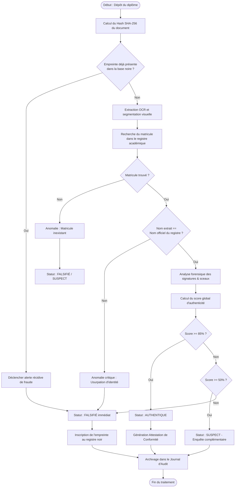
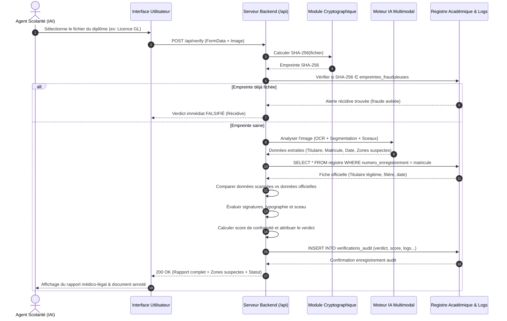
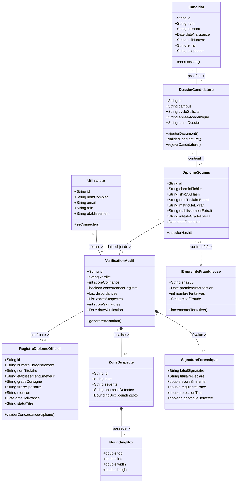

# ANALYSE ET SPÉCIFICATIONS TECHNIQUES DU PROJET
## Système de Vérification et d'Authentification des Diplômes Académiques (Exemple d'application : Campus IAI-Cameroun)

---

### 1. Présentation Brève et Claire du Projet

Lorsqu'un candidat dépose son dossier d'admission ou de recrutement (par exemple au sein du campus **IAI-Cameroun**), le diplôme académique fourni (Baccalauréat, BTS, Licence, Master, Ingénieur) doit faire l'objet d'une authentification rigoureuse.

Ce système fournit une plateforme d'analyse forensique et de contrôle croisé automatisé permettant d'examiner instantanément le document numérisé afin de statuer sans équivoque sur son statut :
- **AUTHENTIQUE** : Diplôme conforme, concordant avec le registre national / de l'établissement émetteur, signatures et sceaux valides.
- **FALSIFIÉ** : Altération typographique détectée, discordance entre les données du document et le matricule officiel du registre (ex: usurpation de numéro de série), récidive d'empreinte numérique compromise ou sceau contrefait.
- **SUSPECT** : Anomalie de résolution, micro-décalages, signatures non reconnues ou absence de concordance stricte nécessitant un arbitrage humain.

Le système est **exclusivement dédié aux diplômes et titres académiques** (aucun certificat médical).

---

### 2. Les Acteurs du Système et Leurs Rôles

| Acteur | Type | Rôles & Responsabilités |
| :--- | :--- | :--- |
| **Candidat / Déposant** | Humain (Externe) | • Dépose son dossier de candidature au campus (numérisation de son diplôme).<br>• Fournit les pièces d'identité associées.<br>• Reçoit une notification ou récépissé d'instruction. |
| **Agent d'Admission / Scolarité (IAI-Cameroun)** | Humain (Principal) | • Téléverse ou numérise le diplôme reçu dans l'application.<br>• Lance la vérification automatique multi-critères.<br>• Consulte le rapport d'analyse et les zones suspectes mises en évidence.<br>• Valide ou rejette le dossier de candidature.<br>• Édite l'attestation officielle de vérification (certificat d'authenticité). |
| **Auditeur / Responsable Conformité & Fraude** | Humain (Superviseur) | • Supervise le registre officiel des diplômes accrédités.<br>• Enregistre de nouveaux diplômes ou met à jour la base de référence.<br>• Traite les alertes de récidive et consulte le journal d'audit immuable.<br>• Effectue des comparaisons côte à côte (originaux vs documents suspects). |
| **Moteur d'Analyse IA (Vision Multimodale & OCR)** | Système Automatisé | • Extrait les métadonnées textuelles par OCR à haute fidélité.<br>• Localise par coordonnées précises les anomalies géométriques, polices hétérogènes et retouches.<br>• Analyse biométrique et forensique des signatures manuscrites et sceaux. |
| **Référentiel National / Registre Académique** | Système / Base de données | • Fournit la vérité terrain officielle (matricule, titulaire officiel, filière, date de délivrance).<br>• Permet la détection automatique des usurpations d'identité. |

---

### 3. Schéma Relationnel et Tables de la Base de Données

#### Table 1 : `candidats` (Porteurs des dossiers de candidature)
Stocke les personnes physiques déposant un dossier à l'établissement.
- `id` (VARCHAR(36), PK) : Identifiant unique du candidat (UUID).
- `nom` (VARCHAR(100), NOT NULL) : Nom de famille.
- `prenom` (VARCHAR(100), NOT NULL) : Prénom(s).
- `date_naissance` (DATE, NOT NULL) : Date de naissance du candidat.
- `lieu_naissance` (VARCHAR(100)) : Ville / Lieu de naissance.
- `nationalite` (VARCHAR(50), NOT NULL) : Ex: Camerounaise.
- `cni_numero` (VARCHAR(50), UNIQUE) : Numéro de Carte Nationale d'Identité ou Passeport.
- `email` (VARCHAR(150), UNIQUE, NOT NULL) : Email de contact.
- `telephone` (VARCHAR(30)) : Numéro de téléphone.
- `cree_le` (TIMESTAMP, DEFAULT CURRENT_TIMESTAMP) : Date d'enregistrement.

#### Table 2 : `dossiers_candidature` (Dossiers déposés à l'IAI-Cameroun)
Représente une soumission de candidature pour un cursus spécifique.
- `id` (VARCHAR(36), PK) : Identifiant unique du dossier.
- `candidat_id` (VARCHAR(36), FK -> `candidats.id`) : Référence du candidat.
- `campus` (VARCHAR(100), DEFAULT 'IAI-Cameroun') : Campus récepteur.
- `cycle_sollicite` (VARCHAR(100), NOT NULL) : Ex: Ingénieur des Travaux Informatiques, Master TI.
- `annee_academique` (VARCHAR(9), NOT NULL) : Ex: '2025-2026'.
- `statut_dossier` (ENUM('EN_ATTENTE', 'VERIFIE_VALIDE', 'REJETE_FRAUDE', 'EN_RECOURS')) : État du dossier.
- `depose_le` (TIMESTAMP, DEFAULT CURRENT_TIMESTAMP) : Horodatage de dépôt.

#### Table 3 : `diplomes_soumis` (Diplômes physiques numérisés pour contrôle)
Le document déposé au sein du dossier et analysé par le système.
- `id` (VARCHAR(36), PK) : Identifiant unique du document soumis.
- `dossier_id` (VARCHAR(36), FK -> `dossiers_candidature.id`) : Dossier rattaché.
- `chemin_fichier` (VARCHAR(255), NOT NULL) : URL ou chemin du fichier numérisé.
- `sha256_hash` (CHAR(64), NOT NULL) : Empreinte cryptographique SHA-256 du fichier scanné.
- `nom_titulaire_extrait` (VARCHAR(150)) : Nom lisible par OCR.
- `matricule_extrait` (VARCHAR(100)) : Numéro de série / enregistrement lu sur le diplôme.
- `etablissement_extrait` (VARCHAR(150)) : Établissement émetteur lu.
- `intitule_grade_extrait` (VARCHAR(150)) : Grade lu (Licence, BTS, Bac...).
- `date_obtention_extraite` (DATE) : Date de délivrance lue sur le document.

#### Table 4 : `registre_diplomes_officiels` (Vérité terrain certifiée)
La base de référence officielle des universités et ministères émetteurs (ex: Université de Yaoundé I, Université de Douala, IAI, etc.).
- `id` (VARCHAR(36), PK) : Identifiant unique d'enregistrement.
- `numero_enregistrement` (VARCHAR(100), UNIQUE, NOT NULL) : Numéro matricule authentique.
- `nom_titulaire` (VARCHAR(150), NOT NULL) : Nom et prénom du véritable diplômé.
- `date_naissance` (DATE) : Date de naissance du titulaire légitime.
- `etablissement_emetteur` (VARCHAR(150), NOT NULL) : Institution de délivrance.
- `grade_consigne` (VARCHAR(150), NOT NULL) : Intitulé exact du diplôme octroyé.
- `filiere_specialite` (VARCHAR(150), NOT NULL) : Ex: Génie Logiciel, Réseaux & Télécoms.
- `mention` (VARCHAR(50)) : Ex: Très Bien, Bien, Assez Bien.
- `date_delivrance` (DATE, NOT NULL) : Date officielle d'émission.
- `statut_titre` (ENUM('VALIDE', 'REVOQUE', 'PERDU')) : Statut officiel du titre.
- `signataires_habilites` (TEXT) : Liste des doyens / recteurs habilités à cette date.

#### Table 5 : `verifications_audit` (Rapports médico-légaux & audits d'analyse)
Journalisation immuable de chaque contrôle effectué par l'agent ou le système.
- `id` (VARCHAR(36), PK) : Identifiant du contrôle (ex: `VERIF-2025-XXXX`).
- `diplome_soumis_id` (VARCHAR(36), FK -> `diplomes_soumis.id`) : Document audité.
- `agent_id` (VARCHAR(36), FK -> `utilisateurs.id`) : Agent ayant opéré l'analyse.
- `verdict` (ENUM('AUTHENTIQUE', 'FALSIFIE', 'SUSPECT')) : Résultat final de l'analyse.
- `score_confiance` (INT, CHECK(0 <= score_confiance <= 100)) : Indice global de conformité.
- `concordance_registre` (BOOLEAN, NOT NULL) : True si le matricule et le titulaire coïncident.
- `details_discordances` (JSON) : Liste des contradictions décelées (ex: nom usurpé).
- `zones_suspectes_json` (JSON) : Coordonnées (bounding boxes) des altérations détectées.
- `signature_forensique_score` (INT) : Score de correspondance des signatures (0 à 100).
- `duree_traitement_ms` (INT) : Temps de calcul (ex: 1850 ms).
- `date_verification` (TIMESTAMP, DEFAULT CURRENT_TIMESTAMP) : Date et heure précises.

#### Table 6 : `empreintes_frauduleuses` (Registre noir anti-récidive)
Empreintes SHA-256 de faux diplômes déjà interceptés pour blocage instantané.
- `sha256` (CHAR(64), PK) : Empreinte de hachage du fichier contrefait.
- `premiere_interception` (TIMESTAMP, DEFAULT CURRENT_TIMESTAMP) : Date de 1ère détection.
- `nombre_tentatives` (INT, DEFAULT 1) : Compteur de tentatives de réutilisation frauduleuse.
- `motif_fraude` (VARCHAR(255), NOT NULL) : Motif (ex: Usurpation d'identité, faux tampon).
- `dernier_candidat_fraudeur` (VARCHAR(150)) : Nom associé à la dernière tentative.

#### Table 7 : `utilisateurs` (Comptes d'accès au système)
- `id` (VARCHAR(36), PK) : UUID du compte.
- `nom_complet` (VARCHAR(100), NOT NULL) : Nom & prénom de l'agent.
- `email` (VARCHAR(150), UNIQUE, NOT NULL) : Identifiant de connexion.
- `mot_de_passe_hash` (VARCHAR(255), NOT NULL) : Mot de passe chiffré (Argon2 / Bcrypt).
- `role` (ENUM('AGENT_SCOLARITE', 'RESPONSABLE_FRAUDE', 'ADMINISTRATEUR')) : Rôle RBAC.
- `etablissement` (VARCHAR(100), DEFAULT 'IAI-Cameroun') : Organisation de rattachement.
- `cree_le` (TIMESTAMP, DEFAULT CURRENT_TIMESTAMP) : Date de création.

---

### 4. Diagramme des Cas d'Utilisation (Use Case)

#### Scénario Nominal :
1. **L'Agent de Scolarité** s'authentifie sur la plateforme IAI-Cameroun.
2. Il accède à la fonction **"Vérifier un diplôme académique"**.
3. Il téléverse la copie numérisée (PDF ou image haute résolution) du diplôme déposé par le candidat.
4. Le système exécute le pipeline de contrôle :
   - Calcul de l'empreinte SHA-256 et vérification dans la base noire anti-récidive.
   - Extraction OCR multimodale des données (nom, grade, institution, numéro de série, date).
   - Contrôle croisé avec le **Registre National des Diplômes**.
   - Analyse forensique des signatures et sceaux académiques.
5. L'Agent consulte le rapport détaillé : score global, concordance des métadonnées, localisation visuelle des zones suspectes.
6. Si le diplôme est authentique, l'Agent génère et imprime **l'Attestation Officielle de Conformité**.
7. Si une fraude est détectée (ex: matricule appartenant à un tiers, faux tampon), le dossier est rejeté et l'empreinte est indexée dans le registre noir.

```mermaid
usecaseDiagram
actor "Agent de Scolarité (IAI)" as Agent
actor "Responsable Conformité / Fraude" as Auditeur
actor "Système IA & Registre" as IA

package "Système d'Authentification des Diplômes Académiques" {
  usecase "S'authentifier" as UC_Auth
  usecase "Numériser & Déposer le diplôme" as UC_Upload
  usecase "Lancer l'audit automatique" as UC_Audit
  usecase "Consulter les zones d'anomalies visuelles" as UC_Zones
  usecase "Vérifier la concordance dans le Registre" as UC_CrossCheck
  usecase "Analyser les signatures & sceaux" as UC_Forensics
  usecase "Générer l'Attestation Officielle" as UC_Certificate
  usecase "Comparer 2 diplômes côte-à-côte" as UC_Compare
  usecase "Consulter le Journal d'Audit & Statistiques" as UC_Logs
  usecase "Enregistrer un diplôme officiel au registre" as UC_Register
}

Agent --> UC_Auth
Agent --> UC_Upload
Agent --> UC_Audit
Agent --> UC_Zones
Agent --> UC_Certificate

Auditeur --> UC_Auth
Auditeur --> UC_Compare
Auditeur --> UC_Logs
Auditeur --> UC_Register

UC_Audit ..> UC_CrossCheck : <<include>>
UC_Audit ..> UC_Forensics : <<include>>
UC_CrossCheck --> IA
UC_Forensics --> IA
```

---

### 5. Diagramme d'Activité (Activity Diagram)

#### Déroulement de l'Activité : "Vérification d'un Diplôme Déposé"
1. Réception du diplôme scanné.
2. Hachage SHA-256 : Est-il fiché dans la base des faux diplômes ?
   - *Oui* : Alerte immédiate de récidive, rejet automatique du dossier.
   - *Non* : Poursuite de l'analyse.
3. Extraction multimodale OCR : Lecture du titulaire, matricule, établissement et grade.
4. Recherche du matricule dans le Registre National :
   - *Matricule inexistant* : Faux diplôme (inconnu au bataillon).
   - *Matricule existant mais titulaire différent* : Fraude critique par usurpation de numéro.
   - *Matricule existant et titulaire concordant* : Concordance validée.
5. Examen forensique de la signature et du sceau :
   - Détection d'artefacts numériques, copiés-collés de tampons, trames hétérogènes.
6. Calcul du score final pondéré :
   - Score >= 85% : Statut `AUTHENTIQUE`.
   - Score entre 50% et 84% : Statut `SUSPECT` (Revue manuelle requise).
   - Score < 50% ou discordance critique : Statut `FALSIFIÉ`.
7. Enregistrement horodaté au Journal d'Audit immuable.



---

### 6. Diagramme de Séquence (Sequence Diagram)

#### Scénario : "Contrôle d'un Diplôme Déposé à l'IAI-Cameroun"
- **Acteur** : Agent de Scolarité
- **Frontend** : Interface Web de Vérification
- **Backend API** : Serveur Express / Node.js
- **Moteur IA Vision** : Service d'analyse multimodale OCR
- **Registre DB** : Base de données officielle



---

### 7. Diagramme de Classes et Relations (Class Diagram)

Ce diagramme illustre la structure des objets métier et leurs cardinalités.



---

### 8. Technologies Utilisées

| Composant | Technologie | Justification Technique |
| :--- | :--- | :--- |
| **Frontend** | **React 18 & TypeScript** | Interface réactive, typage fort éliminant les erreurs d'exécution, gestion dynamique de l'état du document. |
| **Styling & UI** | **Tailwind CSS** | Design épuré, typographie contrastée et accessible, respect strict de la sobriété visuelle demandée. |
| **Animations & Transitions** | **Motion (`motion/react`)** | Fluidité des transitions d'affichage (rapports, zoom sur zones suspectes) sans latence. |
| **Backend Serveur** | **Node.js & Express** | Architecture serveur légère, API RESTful sécurisée (`/api/verify`, `/api/health`), isolation totale des clés API sensibles côté serveur. |
| **Analyse Multimodale & Vision** | **Gemini Multimodal Vision API** | Analyse optique à haute résolution permettant l'extraction OCR contextuelle, la segmentation géométrique des zones altérées et la comparaison des sceaux. |
| **Cryptographie & Sécurité** | **SHA-256 (Web Crypto API & Node `crypto`)** | Calcul instantané d'une empreinte immuable pour chaque diplôme, détection immédiate des récidives frauduleuses. |
| **Visualisation & Forensic** | **HTML5 Canvas & SVG** | Restitution vectorielle des niveaux de pression des signatures manuscrites et surbrillance chirurgicale des zones suspectes sur le diplôme. |
| **Export & Conformité** | **Impression CSS standardisée & JSON** | Génération directe d'Attestations Officielles de Vérification imprimables et exportables avec QR Code d'intégrité. |
